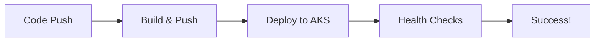

# GitHub Actions CI/CD Pipelines

This directory contains GitHub Actions workflows for deploying the e-commerce microservices to Azure Kubernetes Service (AKS).

---

## 📁 Workflows

### 1. **deploy-infrastructure.yml**

Deploys Azure infrastructure using Bicep templates.

**Triggers:**

- Manual dispatch (workflow_dispatch)
- Push to `main` branch (infrastructure changes)

**What it does:**

- Creates Resource Group
- Deploys AKS cluster
- Creates Azure Container Registry (ACR)
- Sets up networking and monitoring
- Can also destroy infrastructure

### 2. **build-and-push.yml**

Builds Docker images and pushes to ACR.

**Triggers:**

- Manual dispatch (workflow_dispatch)
- Push to `main` branch (service code changes)

**What it does:**

- Builds Docker images for services
- Pushes images to ACR
- Tags with commit SHA and 'latest'
- Can build individual services or all

### 3. **deploy-to-aks.yml**

Deploys applications to AKS cluster.

**Triggers:**

- Manual dispatch (workflow_dispatch)
- After successful "Build and Push" workflow

**What it does:**

- Updates Kubernetes manifests
- Creates secrets
- Deploys data layer (PostgreSQL, Redis, RabbitMQ)
- Deploys microservices
- Configures ingress
- Runs health checks

---

## 🚀 Setup Instructions

### 1. Create Azure Service Principal

```bash
# Login to Azure
az login

# Create service principal
az ad sp create-for-rbac \
  --name "github-actions-ecommerce" \
  --role contributor \
  --scopes /subscriptions/<YOUR_SUBSCRIPTION_ID> \
  --sdk-auth

# Copy the entire JSON output
```

### 2. Configure GitHub Secrets

Go to your GitHub repository → Settings → Secrets and variables → Actions

Create the following **Repository Secrets**:

| Secret Name         | Description                  | How to Get                          |
| ------------------- | ---------------------------- | ----------------------------------- |
| `AZURE_CREDENTIALS` | Azure service principal JSON | Output from step 1                  |
| `POSTGRES_PASSWORD` | PostgreSQL password          | Generate: `openssl rand -base64 32` |
| `RABBITMQ_PASSWORD` | RabbitMQ password            | Generate: `openssl rand -base64 32` |
| `JWT_SECRET`        | JWT signing secret           | Generate: `openssl rand -base64 32` |

**Example AZURE_CREDENTIALS format:**

```json
{
  "clientId": "xxx",
  "clientSecret": "xxx",
  "subscriptionId": "xxx",
  "tenantId": "xxx"
}
```

### 3. Create GitHub Environments (Optional but Recommended)

Go to Settings → Environments

Create three environments:

- **dev** (no protection rules)
- **staging** (require 1 reviewer)
- **prod** (require 2 reviewers)

For each environment, add:

- Protection rules
- Environment secrets (if different per env)

---

## 📋 Usage

### Deploy Infrastructure (One Time Setup)

1. Go to **Actions** tab in GitHub
2. Select **"Deploy Infrastructure"** workflow
3. Click **"Run workflow"**
4. Select:
   - **Environment:** dev/staging/prod
   - **Action:** deploy
5. Click **"Run workflow"**

⏱️ Takes ~15 minutes

### Build and Push Images

1. Go to **Actions** tab
2. Select **"Build and Push Images"** workflow
3. Click **"Run workflow"**
4. Select:
   - **Environment:** dev/staging/prod
   - **Service:** all/product-service/user-service/frontend-service
5. Click **"Run workflow"**

⏱️ Takes ~5-10 minutes

### Deploy to AKS

1. Go to **Actions** tab
2. Select **"Deploy to AKS"** workflow
3. Click **"Run workflow"**
4. Select:
   - **Environment:** dev/staging/prod
   - **Image tag:** latest (or specific commit SHA)
5. Click **"Run workflow"**

⏱️ Takes ~5-10 minutes

---

## 🔄 Automated Deployment Flow



### Automatic Triggers

1. **Infrastructure Changes** (`infrastructure/bicep/**`)
   - Automatically validates and deploys infrastructure

2. **Service Code Changes** (`services/**`)
   - Automatically builds and pushes new images
   - Automatically deploys to AKS (if enabled)

---

## 🎯 Complete Deployment Workflow

### First Time Setup

```bash
# Step 1: Deploy Infrastructure (Manual)
# GitHub Actions → Deploy Infrastructure → dev → deploy

# Step 2: Build Images (Manual)
# GitHub Actions → Build and Push → dev → all services

# Step 3: Deploy to AKS (Manual)
# GitHub Actions → Deploy to AKS → dev → latest
```

### Subsequent Deployments

Just push code to `main` branch:

```bash
git add .
git commit -m "Update product service"
git push origin main

# GitHub Actions will automatically:
# 1. Build new images
# 2. Deploy to dev environment
```

---

## 🐛 Troubleshooting

### Pipeline Fails on Azure Login

**Issue:** AZURE_CREDENTIALS invalid

**Solution:**

```bash
# Recreate service principal
az ad sp create-for-rbac \
  --name "github-actions-ecommerce" \
  --role contributor \
  --scopes /subscriptions/<SUBSCRIPTION_ID> \
  --sdk-auth

# Update GitHub secret
```

### Cannot Create Secrets in Kubernetes

**Issue:** Secrets already exist

**Solution:** Secrets are created with `--dry-run=client -o yaml | kubectl apply -f -` to be idempotent. If still failing, delete and recreate:

```bash
kubectl delete secret database-secrets -n ecommerce
kubectl delete secret jwt-secrets -n ecommerce
```

### Images Not Found

**Issue:** ACR integration not working

**Solution:**

```bash
# Verify ACR role assignment
az role assignment list --scope $(az acr show --name <ACR_NAME> --query id -o tsv)

# Should see "AcrPull" role assigned to AKS kubelet identity
```

### Deployment Stuck

**Issue:** Pods not starting

**Solution:**

```bash
# Check pod status
kubectl get pods -n ecommerce

# Check pod logs
kubectl logs <POD_NAME> -n ecommerce

# Describe pod for events
kubectl describe pod <POD_NAME> -n ecommerce
```

---

## 📊 Workflow Status Badges

Add these to your README.md:

```markdown
[](https://github.com/<USERNAME>/<REPO>/actions/workflows/deploy-infrastructure.yml)

[](https://github.com/<USERNAME>/<REPO>/actions/workflows/build-and-push.yml)

[](https://github.com/<USERNAME>/<REPO>/actions/workflows/deploy-to-aks.yml)
```

---

## 🔐 Security Best Practices

### Secrets Management

✅ **DO:**

- Use GitHub Secrets for sensitive data
- Rotate secrets regularly
- Use different secrets per environment
- Enable GitHub environment protection rules

❌ **DON'T:**

- Commit secrets to repository
- Use weak passwords
- Share secrets in plain text
- Use same secrets across environments

### Service Principal Permissions

Create separate service principals per environment:

```bash
# Dev environment
az ad sp create-for-rbac \
  --name "github-actions-ecommerce-dev" \
  --role contributor \
  --scopes /subscriptions/<SUB_ID>/resourceGroups/rg-ecommerce-aks-dev

# Prod environment (least privilege)
az ad sp create-for-rbac \
  --name "github-actions-ecommerce-prod" \
  --role "Kubernetes Cluster - Azure Arc Onboarding" \
  --scopes /subscriptions/<SUB_ID>/resourceGroups/rg-ecommerce-aks-prod
```

---

## 📈 Monitoring Deployments

### View Deployment Logs

1. Go to **Actions** tab
2. Click on workflow run
3. Click on job name
4. Expand steps to see logs

### Deployment Summary

Each workflow provides a summary with:

- Resources created
- Image tags deployed
- Application URLs
- Next steps

Look for the summary at the bottom of each workflow run.

---

## 🔄 Rollback Strategy

### Rollback to Previous Version

```bash
# Option 1: Redeploy with previous image tag
# GitHub Actions → Deploy to AKS → dev → <previous-commit-sha>

# Option 2: Manual kubectl rollback
kubectl rollout undo deployment/product-service -n ecommerce
kubectl rollout undo deployment/user-service -n ecommerce
kubectl rollout undo deployment/frontend-service -n ecommerce
```

---

## 🎓 Learning Resources

- [GitHub Actions Documentation](https://docs.github.com/en/actions)
- [Azure CLI Reference](https://docs.microsoft.com/en-us/cli/azure/)
- [Kubernetes Documentation](https://kubernetes.io/docs/)

---

## ✅ Checklist

Before running workflows, ensure:

- [ ] Azure subscription active
- [ ] Service principal created
- [ ] GitHub secrets configured
- [ ] GitHub environments created (optional)
- [ ] SSH key generated (automatic)
- [ ] Repository permissions set

---

Happy deploying! 🚀
